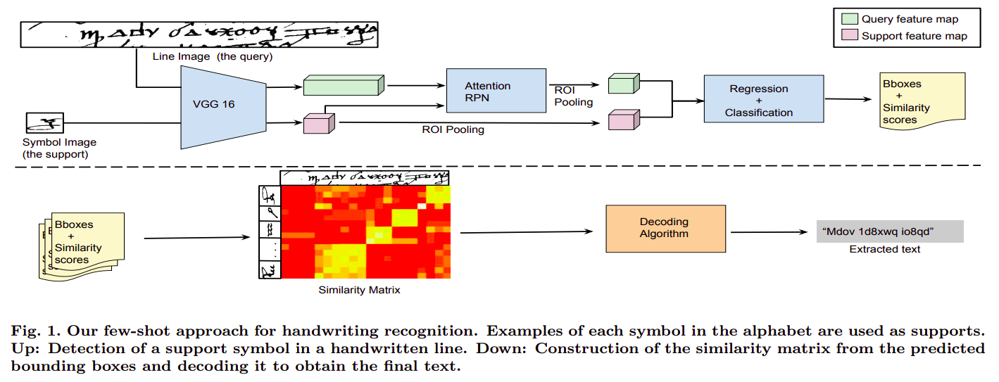
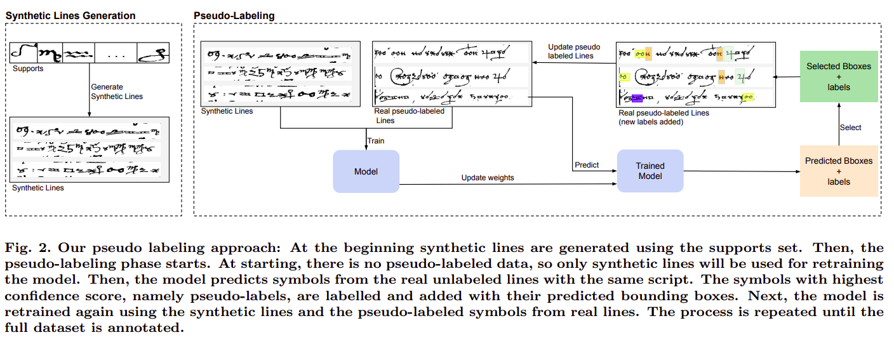

# HTRbyMatching

## Description

A pytorch implementation of the paper [A Few-shot Learning Approach for Historical Ciphered Manuscript Recognition](https://arxiv.org/abs/2009.12577) and its extension [Few Shots Are All You Need: A Progressive Few Shot Learning Approach for Low Resource Handwriting Recognition](https://arxiv.org/abs/2107.10064). The proposed model can be used for low resource handwriting recognition in a few-shot learning scenario. 





## Download Code
clone the repository:
```bash
git clone https://github.com/dali92002/HTRbyMatching
cd HTRbyMatching
```
## Requirements

Create your evironment, with the file htrmatching.yml

## Models

Download the desired weights. These are following the training that was done in [A Few-shot Learning Approach for Historical Ciphered Manuscript Recognition](https://arxiv.org/abs/2009.12577).


<table class="tg">
<thead>
  <tr>
    <th class="tg-c3ow">Training Dataset</th>
    <th class="tg-c3ow">Fine Tuning Dataset</th>
    <th class="tg-c3ow">URL</th>
  </tr>
</thead>
<tbody>
  <tr>
    <td class="tg-c3ow" >Omniglot</td>
    <td class="tg-c3ow">  -- </td>
    <td class="tg-c3ow"><a href="https://drive.google.com/file/d/1MmW-6n8M_u-bMZdMWGLidqfo1uhXlDQQ/view?usp=sharing" target="_blank" rel="noopener noreferrer">model</a></td>
  </tr>
  <tr>
    <td class="tg-c3ow" >Omniglot</td>
    <td class="tg-c3ow">  Borg </td>
    <td class="tg-c3ow"><a href="https://drive.google.com/file/d/15CvT46BDYkI8DdOkm44eiN6f9ecMM5Wh/view?usp=sharing" target="_blank" rel="noopener noreferrer">model</a></td>
  </tr>
    <tr>
    <td class="tg-c3ow" >Omniglot</td>
    <td class="tg-c3ow">  Copiale </td>
    <td class="tg-c3ow"><a href="https://drive.google.com/file/d/1U8-BobTzFIRHMahMKqRiqJFHNc96gUDb/view?usp=sharing" target="_blank" rel="noopener noreferrer">model</a></td>
  </tr>
    <tr>
    <td class="tg-c3ow" >Omniglot</td>
    <td class="tg-c3ow">  Vatican </td>
    <td class="tg-c3ow"><a href="https://drive.google.com/file/d/1qReohSO2pHE2kypMCbq850-dAZTDCv25/view?usp=sharing" target="_blank" rel="noopener noreferrer">model</a></td>
  </tr>
  
</tbody>
</table>

## Training 

Coming soon ...

## Testing

Download the desired pretrained weigts from the section Models. Then run the following command. Here we are choosing to recognize the lines of the cipher "borg", in a 1 shot scenario, with the model finetuned on the borg (as will be stated in the testing model path). We specify the input data path: lines and alphabet. As well ass the desired output path, here we want in in a floder named output in this same directory and the threshold 0.4. 

```bash
python test.py --cipher borg --testing_model /MODEL_WEIGHTS_PATH/  --lines ./lines --alphabet ./alphabet  --output ./output_result --shots 1 --thresh 0.4
```

Please, check the folders named lines and alphabet to realize how you should provide your input data. After running you will receive the results in a 3 subfolders of your output folder.  

## Training in a progressive way (Coming soon)

This part is related to the paper [Few Shots Are All You Need: A Progressive Few Shot Learning Approach for Low Resource Handwriting Recognition](https://arxiv.org/abs/2107.10064). ... 

## Citation 
If you find this useful for your research, please cite it as follows:

```bash
@inproceedings{souibgui2021few,
  title={A few-shot learning approach for historical ciphered manuscript recognition},
  author={Souibgui, Mohamed Ali and Forn{\'e}s, Alicia and Kessentini, Yousri and Tudor, Crina},
  booktitle={2020 25th International Conference on Pattern Recognition (ICPR)},
  pages={5413--5420},
  year={2021},
  organization={IEEE}
}
```
```bash
@article{souibgui2021few,
  title={Few Shots Are All You Need: A Progressive Few Shot Learning Approach for Low Resource Handwriting Recognition},
  author={Souibgui, Mohamed Ali and Forn{\'e}s, Alicia and Kessentini, Yousri and Megyesi, Be{\'a}ta},
  journal={arXiv preprint arXiv:2107.10064},
  year={2021}
}
```